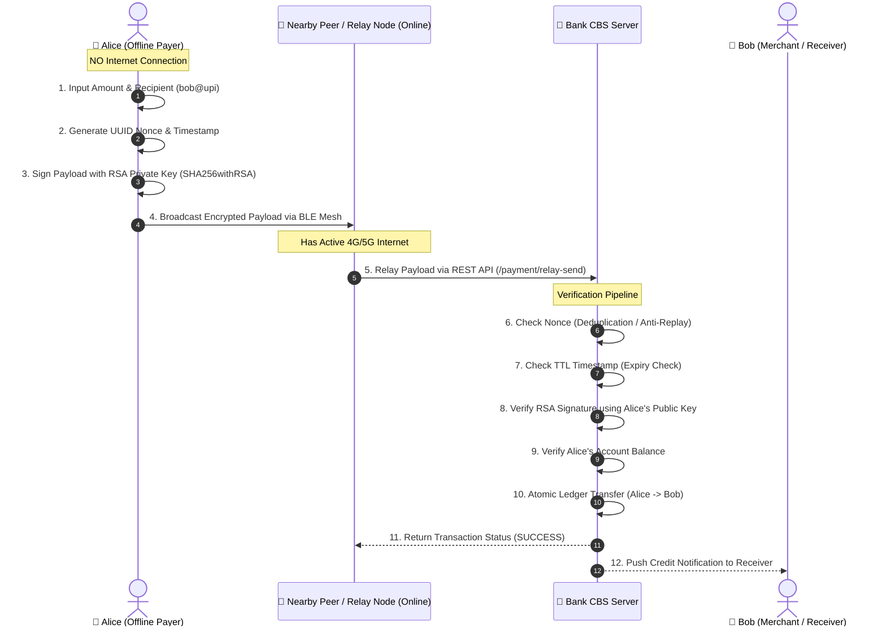
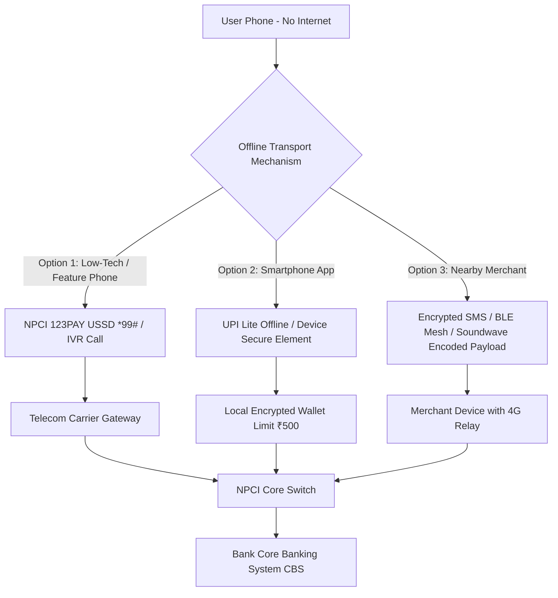

# ⚡ Offline UPI Bluetooth Mesh Relay System

> **A Secure, Cryptographically Signed Peer-to-Peer Relay Protocol for Internet-Free UPI Payments**

[](https://spring.io/projects/spring-boot)
[](https://www.oracle.com/java/)
[](https://en.wikipedia.org/wiki/RSA_(cryptosystem))
[](https://www.bluetooth.com/)

---

## 📌 Executive Summary

Traditional Unified Payments Interface (UPI) payment applications (such as **PhonePe**, **Google Pay**, and **Paytm**) strictly require active internet connectivity (4G/5G/Wi-Fi) on both the **Payer (Sender)** and **Payee (Merchant/Receiver)** devices to communicate with NPCI (National Payments Corporation of India) servers and Core Banking Systems (CBS).

When a user is in a **zero-connectivity zone** (basements, remote rural areas, crowded stadiums, transit tunnels, or during network outages), standard UPI transactions immediately fail.

This project implements an **Offline UPI Store-and-Forward Mesh Protocol** using **Asymmetric RSA-2048 Cryptography**, **Cryptographic Nonces**, **Temporal TTL Expiration**, and **Opportunistic Bluetooth Mesh Relaying**. It allows an offline sender to sign a payment instruction locally, broadcast it via short-range radio (Bluetooth Low Energy) to nearby online relay devices (peers), which then transport and settle the payment asynchronously with the Bank Server.

---

## 📐 System Architecture & Real-World Flow



### Real-Life Comparison: Traditional UPI vs. Offline UPI Relay

| Dimension | Standard UPI (PhonePe / GPay / Paytm) | Offline UPI Mesh Relay Project |
| :--- | :--- | :--- |
| **Internet Dependency** | ❌ Mandatory 2-way live internet connection on Payer phone | ✅ **Zero internet needed on Payer phone** |
| **Authentication** | 4/6-Digit MPIN verified live on NPCI/Bank server | **Local RSA-2048 Digital Signature** signed via device Private Key |
| **Transport Medium** | HTTPS / TLS 1.3 over Cellular IP Data | **Bluetooth Low Energy (BLE) Mesh** broadcast to nearby online devices |
| **Replay Protection** | Bank Session Token & SSL Pinning | **Cryptographic Nonce (UUID)** stored & deduplicated at Bank Server |
| **Tamper Resistance** | TLS Payload Encryption | **SHA256withRSA Signature** (Payload alteration breaks signature) |
| **Temporal Expiry** | 30-60 second HTTP Timeout | **Configurable TTL (Time-To-Live)** window (e.g., 300 seconds) |

---

## 📁 Complete File & Directory Breakdown

Below is an exhaustive reference for every file and folder in the repository:

```
s:\OfflineUPI
├── .vscode/
│   └── settings.json                  # VS Code Workspace Configuration
└── offline-upi-server/                # Main Spring Boot Backend & Frontend Module
    ├── .gitattributes                 # Git line-ending normalize settings
    ├── .gitignore                      # Git exclusion patterns
    ├── mvnw                           # Maven Wrapper executable script (Unix/Linux)
    ├── mvnw.cmd                       # Maven Wrapper executable script (Windows)
    ├── pom.xml                        # Project Object Model (Dependencies & Build Configuration)
    ├── .mvn/
    │   └── wrapper/
    │       └── maven-wrapper.properties # Maven Wrapper version configuration
    └── src/
        ├── main/
        │   ├── java/com/offlineupi/offline_upi_server/
        │   │   ├── OfflineUpiServerApplication.java  # Main Spring Boot Entry Point
        │   │   ├── config/
        │   │   │   ├── DataInitializer.java          # Database Seeder (Pre-populates Alice, Bob, Merchant)
        │   │   │   └── SecurityConfig.java           # Spring Security Filter Chain & Password Encoder
        │   │   ├── controller/
        │   │   │   ├── AccountController.java        # REST Controller for Account Management
        │   │   │   ├── PaymentController.java        # REST Controller for Offline Payment Ingestion
        │   │   │   ├── TestController.java           # Server Health Check Endpoint
        │   │   │   └── UserController.java          # User Management Endpoint
        │   │   ├── dto/
        │   │   │   ├── PaymentRequest.java           # Data Transfer Object for Relay Payloads
        │   │   │   └── PaymentResponse.java          # Data Transfer Object for Bank Execution Status
        │   │   ├── entity/
        │   │   │   ├── Account.java                  # JPA Entity for Bank Accounts & Balances
        │   │   │   ├── Payment.java                  # JPA Entity for Payment Ledger & Nonce Tracking
        │   │   │   └── User.java                     # JPA Entity for User Identity & Public Keys
        │   │   ├── repository/
        │   │   │   ├── AccountRepository.java        # Spring Data JPA Repository for Accounts
        │   │   │   ├── PaymentRepository.java        # Spring Data JPA Repository for Payments
        │   │   │   └── UserRepository.java           # Spring Data JPA Repository for Users
        │   │   ├── security/
        │   │   │   ├── DigitalSignatureUtil.java     # Utility for RSA Key Generation & Signature Verification
        │   │   │   └── DigitalSignatureTest.java     # Standalone CLI Test for RSA Signing
        │   │   └── service/
        │   │       └── PaymentService.java           # Core Business Logic (Deduplication, TTL, RSA Check, Ledger Settlement)
        │   └── resources/
        │       ├── application.properties            # Database (H2), Server Port (8081), Hibernate Config
        │       └── static/
        │           └── index.html                    # Glassmorphic Interactive Simulator & Protocol Inspector
        └── test/
            └── java/com/offlineupi/offline_upi_server/
                └── OfflineUpiServerApplicationTests.java # Spring Boot Context Loading Tests
```

---

## 🛠️ Detailed Architectural Components & Code Logic

### 1. Database Entities & Models (`entity/`)
- **[User.java](file:///s:/OfflineUPI/offline-upi-server/src/main/java/com/offlineupi/offline_upi_server/entity/User.java)**: Represents the customer record (`id`, `name`, `phone`, `email`, `upiId`, `password`, `publicKey`). Stores the user's RSA Public Key for signature validation.
- **[Account.java](file:///s:/OfflineUPI/offline-upi-server/src/main/java/com/offlineupi/offline_upi_server/entity/Account.java)**: Represents a bank account (`id`, `accountNumber`, `balance`, `bankName`, `@ManyToOne User`). Holds real-time funds.
- **[Payment.java](file:///s:/OfflineUPI/offline-upi-server/src/main/java/com/offlineupi/offline_upi_server/entity/Payment.java)**: Audited payment transaction record containing `nonce`, `senderUpiId`, `receiverUpiId`, `amount`, `signature`, `status`, `ttlSeconds`, `relayNodeId`, `deduplicatedCount`, `failureReason`, and `timestamp`.

### 2. Cryptographic Security Engine (`security/`)
- **[DigitalSignatureUtil.java](file:///s:/OfflineUPI/offline-upi-server/src/main/java/com/offlineupi/offline_upi_server/security/DigitalSignatureUtil.java)**:
  - Generates RSA-2048 keypairs using standard Java Cryptography Architecture (`KeyPairGenerator`).
  - Signs payload strings with `SHA256withRSA`.
  - Parses PEM-encoded Base64 Public Keys into Java `PublicKey` objects (`X509EncodedKeySpec`).
  - Verifies payload authenticity: returns `false` if a single byte in amount, nonce, or UPI IDs was modified during transit.

### 3. Payment Processing Pipeline (`service/PaymentService.java`)
When a relay node submits a payment to `/payment/relay-send`, the **[PaymentService](file:///s:/OfflineUPI/offline-upi-server/src/main/java/com/offlineupi/offline_upi_server/service/PaymentService.java)** executes a strict 6-stage transaction pipeline:

1. **Deduplication Check (Replay Protection)**:
   - Queries `PaymentRepository` by `nonce`.
   - If the nonce was already processed by a previous relay forwarder, increments `deduplicatedCount` and returns `DUPLICATE_IGNORED` without debiting funds again.
2. **TTL Expiration Check**:
   - Calculates `expiryTime = timestamp + (ttlSeconds * 1000)`.
   - If `currentTime > expiryTime`, records an `EXPIRED` status transaction and halts processing.
3. **Account Resolution**:
   - Locates Sender and Receiver bank accounts using UPI IDs or User IDs.
4. **Digital Signature Verification**:
   - Reconstructs payload signature string: `senderUpi|receiverUpi|amount|nonce|timestamp`.
   - Validates signature using the sender's public key. Rejects tampered payloads with status `INVALID_SIGNATURE`.
5. **Solvency & Balance Verification**:
   - Checks if `senderAccount.getBalance() >= requestedAmount`. Returns `INSUFFICIENT_FUNDS` if balance is low.
6. **Atomic Settlement & Ledger Update**:
   - Debits Sender balance, Credits Receiver balance, persists successful `Payment` entity with status `SUCCESS`.

### 4. Interactive Protocol Simulator (`resources/static/index.html`)
A standalone single-page web app built with Vanilla JS and CSS glassmorphism aesthetics. It features:
- **Web Crypto API**: Generates RSA-2048 keypairs locally in the browser to sign transactions inside an offline sandbox.
- **Multi-Relay Forwarder Simulation**: Simulates simultaneous broadcasting to 3 peer nodes (Coffee Shop, Bus Stop, Metro Station) to test deduplication lock contention.
- **Security Attack Testing**: Buttons to trigger expired TTL attacks or tampered amount attacks to inspect live bank security responses.
- **Audit Ledger**: Real-time table displaying transaction nonces, relay node IDs, status badges, deduplication counters, and updated account balances.

---

## 🔍 System Readiness Assessment

### What is Working 100% (Fully Functional Features)
✅ **Cryptographic Payment Signing & Verification**: Complete end-to-end SHA256withRSA digital signing in the browser and server verification.  
✅ **Anti-Replay Attack Protection**: Nonce deduplication layer preventing double-spending even if multiple peer devices forward the same broadcast.  
✅ **Temporal Validity Controls**: Configurable TTL window enforcing strict expiration rules.  
✅ **Atomic Ledger Settlement**: Transactional Spring Service ensuring balance consistency.  
✅ **Simulated Mesh Visualizer**: Complete single-page dashboard with real-time balance sync and verification step tracking.  

### Current Known Limitations & Edge Cases
⚠️ **In-Memory Database**: Default config uses H2 in-memory DB (`jdbc:h2:mem:offline_upi`). Data resets upon application restart (Can be switched to MySQL by updating `application.properties`).  
⚠️ **Simulated Bluetooth Layer**: Web browsers cannot natively form arbitrary Bluetooth Mesh networks without Native Android/iOS background services. The UI simulates the BLE broadcast layer via JavaScript state.  
⚠️ **Public Key Distribution**: Current implementation accepts `publicKey` in request payload or falls back to database lookup. In production, Public Key certificates must be signed by a trusted PKI / Bank CA.

---

## 🌐 How to Make This Production-Ready (Real-Life Offline UPI Integration)

To connect this logic with real UPI apps (**PhonePe**, **GPay**, **Paytm**) for real-world internet-free payments, the following production mechanisms are utilized in India's banking ecosystem:



### Production Implementation Roadmap:
1. **Android/iOS Native Bluetooth Mesh Service (BLE Advertising)**:
   - Implement `BluetoothLeScanner` and `BluetoothLeAdvertiser` in Kotlin/Swift.
   - Nearby phones running the app continuously act as relay nodes in the background, forwarding encrypted payment packets when they enter cellular network range.
2. **Encrypted SMS Relay Gateway**:
   - Encode signed payload into a compact binary format (Base64 / Hex string < 160 characters).
   - If no Bluetooth peers are available, fallback to background encrypted SMS to an NPCI/Bank shortcode number (similar to standard UPI registration SMS).
3. **Soundwave Communication (Acoustic Data Transfer)**:
   - Encode payment nonce & signature into near-ultrasound audio frequencies (18kHz - 20kHz).
   - The merchant's phone microphone captures the audio tone and processes the payment online.
4. **Hardware Security Module (HSM) & TEE (Trusted Execution Environment)**:
   - Store the user's RSA Private Key inside Android KeyStore / iOS Secure Enclave so it can never be extracted even on rooted/jailbroken devices.
5. **NPCI 123PAY & UPI Lite Integration**:
   - Align transaction limits with RBI regulations (e.g., maximum ₹500 per offline payment, total cumulative offline limit ₹2000 before online sync).

---

## 🚀 Quick Start Guide

### Prerequisites
- **Java Development Kit (JDK 17 or higher)**
- **Maven 3.8+** (or use bundled `mvnw` wrapper)

### Running the Server Locally

1. Navigate to the server folder:
   ```bash
   cd offline-upi-server
   ```
2. Compile and run the application:
   ```bash
   ./mvnw spring-boot:run
   ```
3. Open your browser and navigate to:
   ```
   http://localhost:8081/index.html
   ```

### Test Users Seeded in Database

| User | UPI ID | Initial Balance | Default Password |
| :--- | :--- | :--- | :--- |
| **Alice Sharma** | `alice@upi` | ₹5,000.00 | `password123` |
| **Bob Kumar** | `bob@upi` | ₹1,000.00 | `password123` |
| **SuperMart Store** | `merchant@upi` | ₹500.00 | `password123` |

---

## 🛠️ Tech Stack Summary

- **Backend Framework**: Spring Boot 4.1.0 (Java 17)
- **Security**: Spring Security, BCrypt, RSA-2048, SHA256withRSA
- **Data Access**: Spring Data JPA, Hibernate ORM
- **Database**: H2 In-Memory Database (H2 Console at `/h2-console`)
- **Frontend Engine**: HTML5, Vanilla JavaScript, Custom Glassmorphism CSS, Web Crypto API
- **Build System**: Apache Maven

---

## 📜 License

This project is open-source and available under the [MIT License](LICENSE).
